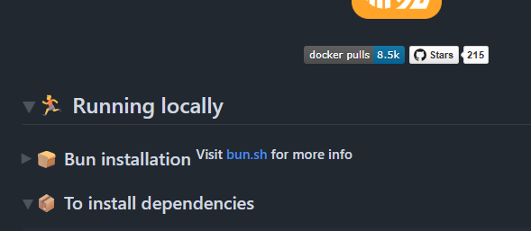
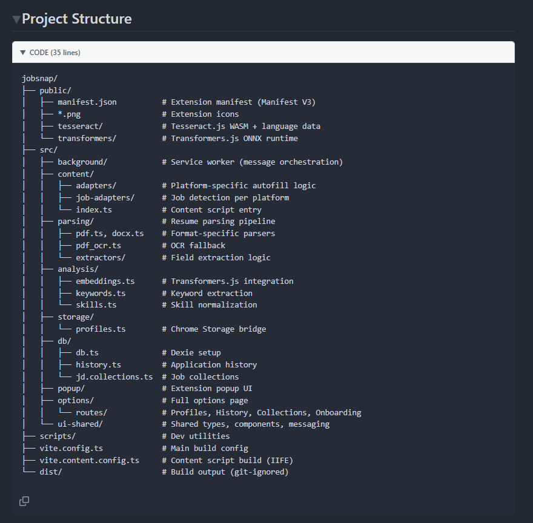
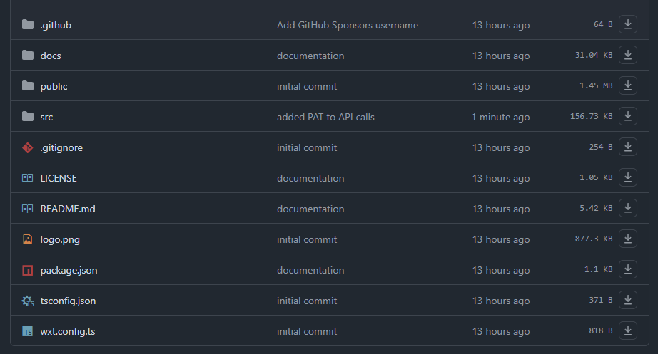
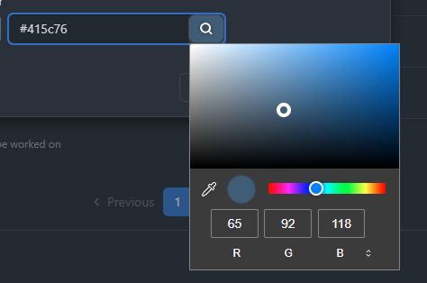
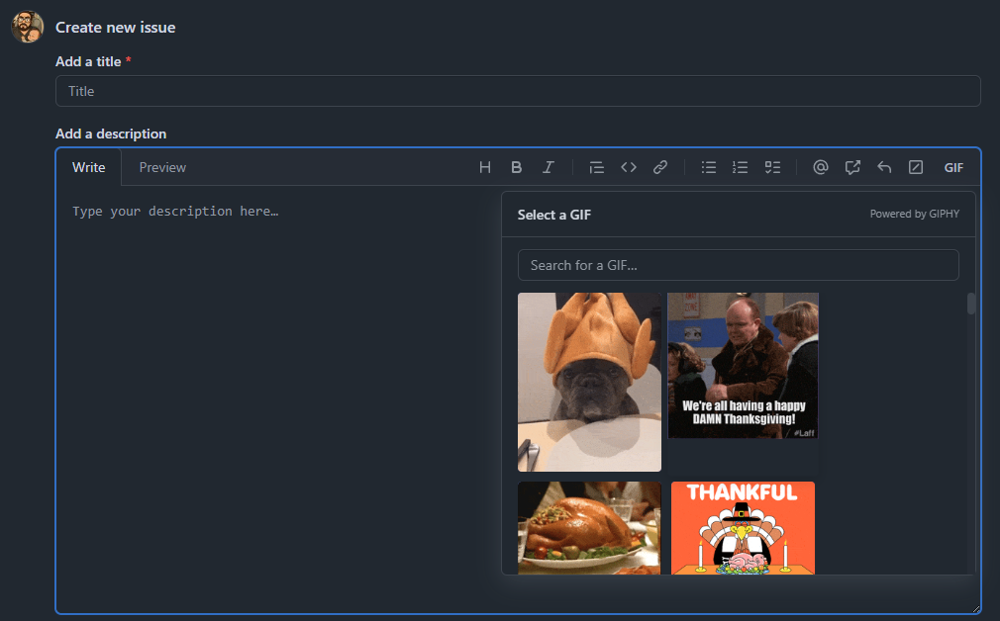

# HubQuilt

A modular, configurable browser extension that enhances GitHub's user interface with powerful productivity features.

[](https://opensource.org/licenses/MIT)

## ✨ Features

HubQuilt provides a collection of enhancements for GitHub:

### 🎨 Visual Enhancements

#### File Icons
Professional file-type icons in file browsers and pull requests


#### Code Colors
Syntax highlighting improvements


#### Collapse Markdown
Collapsible markdown sections in comments



#### Collapse in Comment
Collapse code blocks in issue/PR comments



### 📥 File Management

#### File Downloads & Sizes
Display file/folder sizes with one-click downloads
- Smart caching based on commit timestamps
- Download folders as ZIP files
- Minimal API usage (works efficiently even when rate-limited)



### 🔧 Developer Tools

#### Label Color Picker
Enhanced label color selection



#### Module Linker
Quick navigation for code modules


#### GIFs for Comments
Easy GIF insertion in comments



### 🏗️ Architecture
- **Modular Design**: All features can be toggled independently
- **Page Type Detection**: Features activate only on relevant GitHub pages
- **Configurable Options**: Customize feature behavior through settings
- **Performance Optimized**: Efficient DOM observation and caching strategies

## Development

### Prerequisites

- Node.js (v18 or later recommended)
- npm, pnpm, or bun

### Setup

```bash
# Install dependencies
npm install

# Development (Chrome by default)
npm run dev

# Development for Firefox
npm run dev:firefox

# Build for production
npm run build              # Chrome only (default)
npm run build:chrome       # Chrome specifically
npm run build:firefox      # Firefox specifically
npm run build:edge         # Edge specifically
npm run build:all          # All browsers (Chrome, Firefox, Edge)

# Create distribution zips
npm run zip                # Chrome only
npm run zip:all            # All browsers
```

### Project Structure

```
src/
├── entrypoints/
│   ├── content/
│   │   └── github.ts          # Content script entry point
│   └── options/
│       └── index.html         # Options page
├── core/
│   ├── feature-types.ts       # Type definitions
│   ├── feature-registry.ts    # Feature management
│   ├── github-page-detect.ts  # Page type detection
│   └── github-api-client.ts   # GitHub API client
├── features/
│   ├── sample-highlight-repo-name.ts
│   └── sample-api-based-feature.ts
└── ui/
    └── options-ui.ts          # Options page logic
```

## Loading the Extension

### Chrome/Chromium

1. Run `npm run build:chrome` (or `npm run build`)
2. Open `chrome://extensions`
3. Enable "Developer mode"
4. Click "Load unpacked"
5. Select the `.output/chrome-mv3` directory

### Firefox

1. Run `npm run build:firefox`
2. Open `about:debugging#/runtime/this-firefox`
3. Click "Load Temporary Add-on"
4. Select any file in the `.output/firefox-mv3` directory

### Edge

1. Run `npm run build:edge`
2. Open `edge://extensions`
3. Enable "Developer mode"
4. Click "Load unpacked"
5. Select the `.output/edge-mv3` directory

## GitHub PAT Configuration

Some features require a GitHub Personal Access Token (PAT) for enhanced functionality:

1. Open the extension options page
2. Generate a PAT at https://github.com/settings/tokens with appropriate scopes
3. Paste the token in the options page
4. Click "Save token"

**Security Note**: The PAT is stored locally in your browser using `chrome.storage.local` and is never sent to external servers (only to GitHub API).

## 📚 Documentation

Comprehensive documentation for contributors and developers:

- **[Contributing Guide](./docs/CONTRIBUTING.md)** - How to contribute to HubQuilt
  - Development setup
  - Creating new features
  - Code style guidelines
  - Testing procedures
  - Pull request workflow

- **[Architecture](./docs/ARCHITECTURE.md)** - Technical deep dive
  - System overview
  - Feature system design
  - DOM observation patterns
  - Caching strategies
  - API integration
  - Security considerations

- **[Docs Index](./docs/README.md)** - Documentation directory

## 🤝 Contributing

We welcome contributions! Here's how to get started:

1. Read the [Contributing Guide](./docs/CONTRIBUTING.md)
2. Check out [open issues](https://github.com/tbosak/hubquilt/issues)
3. Fork the repository
4. Create a feature branch
5. Submit a pull request

### Quick Start for Contributors

```bash
# Clone and setup
git clone https://github.com/tbosak/hubquilt.git
cd hubquilt
npm install

# Start development
npm run dev

# Build for production
npm run build:chrome
```

See [CONTRIBUTING.md](./docs/CONTRIBUTING.md) for detailed instructions.

## 🐛 Bug Reports & Feature Requests

- **Bug reports**: [Open an issue](https://github.com/tbosak/hubquilt/issues)
- **Feature requests**: [Open an issue](https://github.com/tbosak/hubquilt/issues) with the enhancement label
- **Questions**: [Start a discussion](https://github.com/tbosak/hubquilt/discussions)

## 📄 License

MIT License - see [LICENSE](./LICENSE) for details

## 🙏 Acknowledgments

- Built with [WXT](https://wxt.dev/) - Next-gen web extension framework
- UI components inspired by [GitHub Primer](https://primer.style/)
- File icons from [file-icons-js](https://github.com/exuanbo/file-icons-js)
